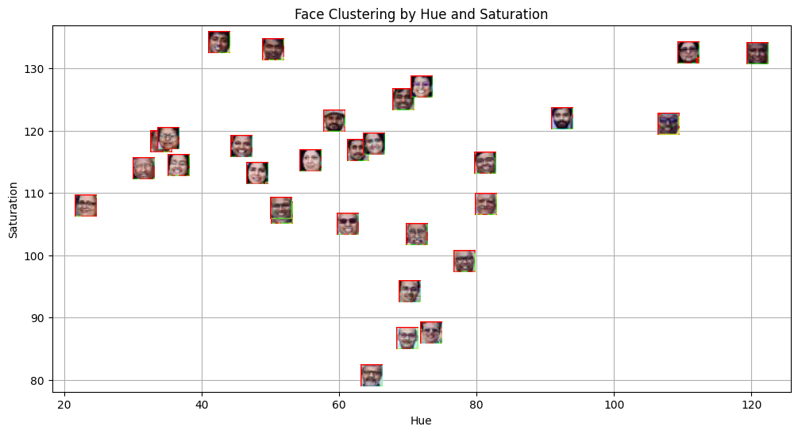
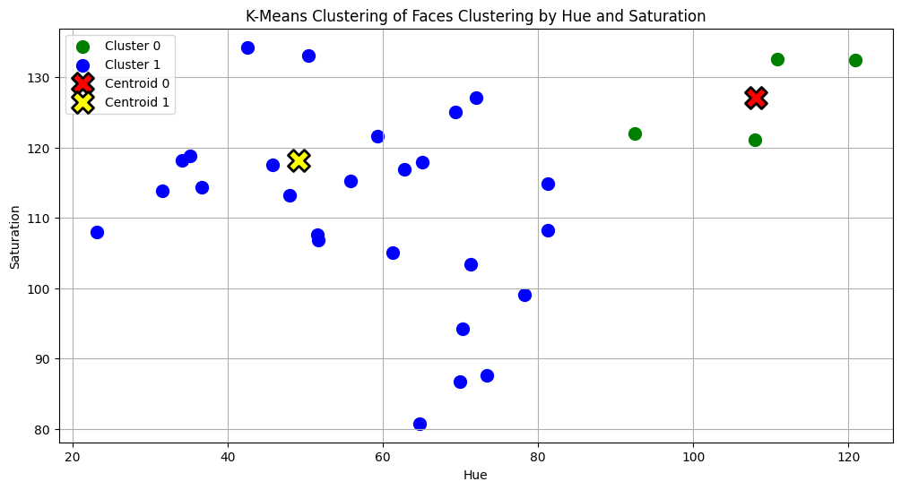
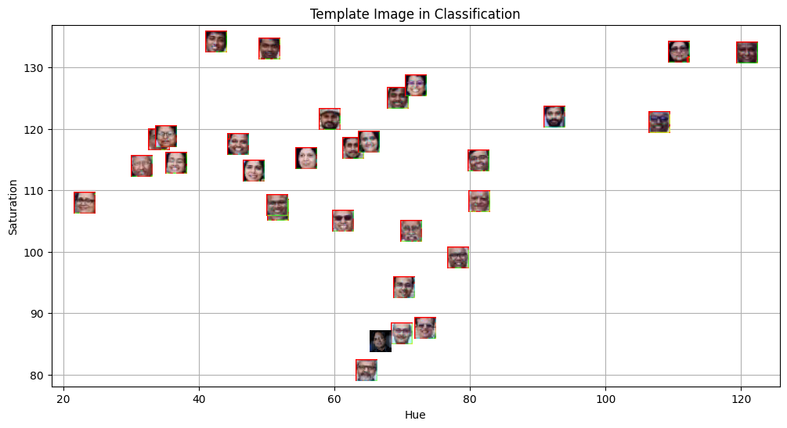
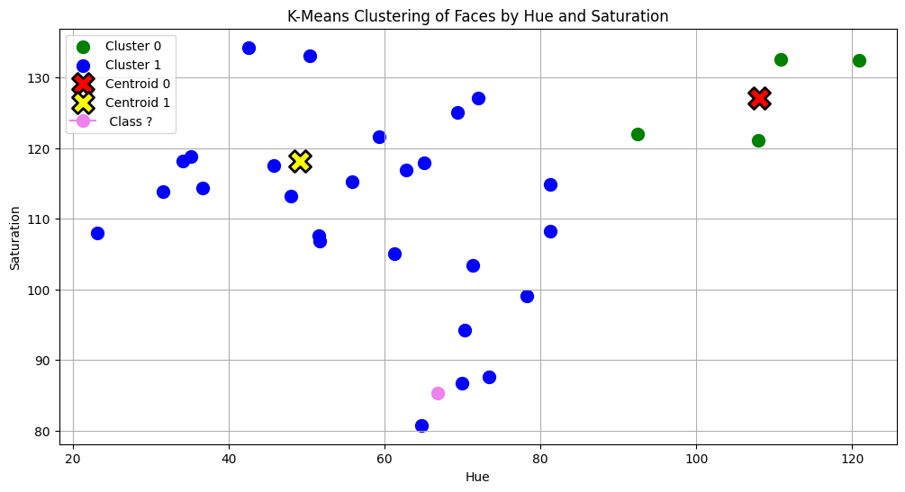

# MLPR Lab 5
Lakshya Gupta, CSAI

## Aim

The aim of this lab is to apply distance-based classification and clustering techniques to facial images.

Specifically, the task is to:

- Detect faces in an image dataset
- Extract color-based features (Hue & Saturation)
- Cluster faces using K-Means clustering
- Compare a template face with clustered faces using distance metrics

---

## Methodology

### 1. Face Detection

Faces were detected from the input image (`Plaksha_Faculty.jpg`) using Haar Cascade classifiers in OpenCV.

Steps:

- Convert image to grayscale
- Apply Haar cascade face detector
- Extract face regions

---

### 2. Feature Extraction (HSV Color Space)

Each detected face was converted from BGR → HSV color space.

Two features were extracted:

- **Hue (H)** — dominant color tone
- **Saturation (S)** — color intensity

These features represent each face in 2-D feature space:

$Face_i = (Hue_i,\ Saturation_i)$

---

### 3. Face Clustering using K-Means

Faces were grouped into 2 clusters (K=2) based on HSV features.

Algorithm:

1. Initialize 2 cluster centroids
2. Assign each face to nearest centroid (Euclidean distance)
3. Update centroids
4. Repeat until convergence

---

### 4️⃣ Template Matching

A template image (`Dr_Shashi_Tharoor.jpg`) was processed similarly:

- Face detection
- HSV feature extraction
- Distance comparison with cluster points

This determines which cluster the template belongs to.

---

## 📊 Results & Visualizations

### 1. Face Clusters in HSV Feature Space

Faces form two separable clusters based on hue–saturation characteristics.

---

### 2. Cluster Visualization with Face Thumbnails

Each face is plotted at its HSV coordinate and grouped into clusters.

---

### 3. Template Face Position in Feature Space

The template face’s HSV feature lies close to one cluster.

---

### 4. Template vs Cluster Comparison

Template face is correctly associated with its nearest cluster using distance.

---

## Key Findings

- HSV color features effectively separate facial images
- K-Means clustering groups similar faces without labels
- Template face distance confirms cluster membership
- Hue & saturation provide robust facial color representation

---

## Conclusions

This lab demonstrates that:

- Distance-based clustering can organize facial images automatically
- HSV color space is suitable for facial similarity analysis
- K-Means effectively partitions faces into meaningful groups
- Template matching using feature distance enables recognition
